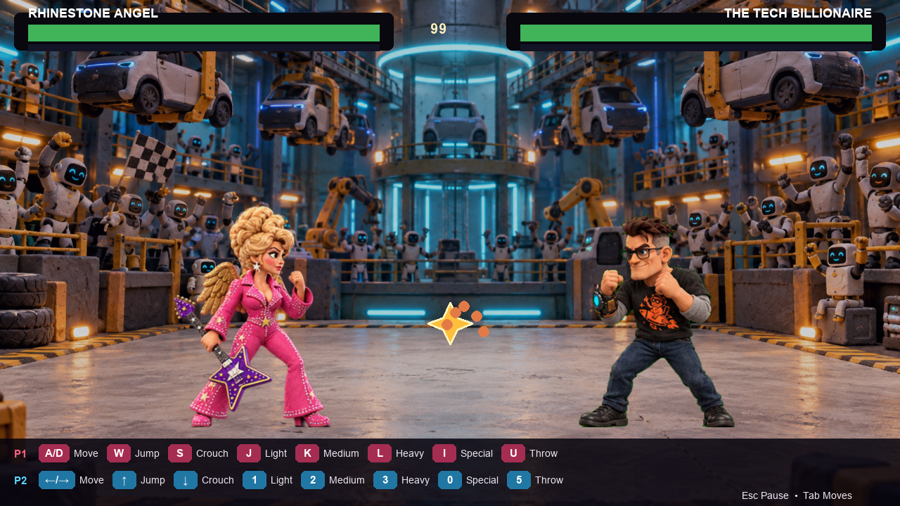

# Premium Gameplay Presentation Verification

Date: 2026-09-13

## Delivered

- Replaced the generic runtime fighters with 64 transparent 512 x 512 action frames derived from the four approved character designs.
- Routed idle, movement, jump, guard, light, medium, heavy, special, hit, knockdown, recovery, victory, and defeat clips through each fighter manifest.
- Added clearer hit, block, movement, special, knockout, and clay-impact effects.
- Kept all 12 fighter-versus-opponent fatality sequences wired and corrected their frame cache so opening and ending frames remain available during playback.
- Added an in-match keyboard guide for both players, fighter names, health, special meters, shield feedback, and the 99-second clock.
- Changed Player 1 to familiar keyboard controls: WASD movement, J/K/L attacks, I special, and U throw. Player 2 uses arrows and the numeric keypad.
- Added mouse hover focus and left-click confirmation through the title, fighter selection, arena selection, and other menu screens. Right-click performs Back.

## Verification

- `ruff check src tests art_source/characters/build_premium_runtime_frames.py`: passed.
- `pytest`: 52 passed.
- Loaded all 64 premium RGBA frames and resolved every animation route in all four manifests.
- Exercised title screen to selection to match with scripted Pygame mouse events.
- Loaded all 12 fatalities with 30 frames each and verified their opening and final frames remain cached within the presentation budget.
- Rendered a live Pygame gameplay frame at 1280 x 720.

## Visual evidence

