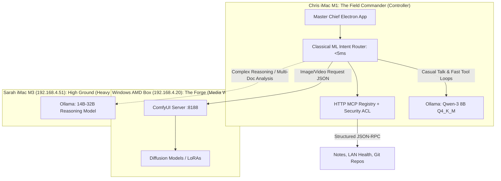

# Master Chief Hologram: System Architecture & Hardware Alignment Strategy

**Architect:** Dr. Christopher Decker, Ph.D.  
**Platform Target:** Master Chief Hologram (`grummpy/master-chief-hologram`)  
**Mission:** Aligning Connectors, Nodes, and Model Training/Adaptation for Home LAN AI

---

## 🏛️ 1. The Unified LAN Node Hierarchy

To maximize the unique strengths of each computer on your household network, assign tasks based on their specific silicon capabilities:



---

## 🔌 2. Connector Architecture: The HTTP MCP Tool Bus

Rather than hardcoding tool scripts into the Electron app, use the **Model Context Protocol (MCP)** via standard HTTP/JSON-RPC:

1. **Lightweight & Isolated:** Each tool runs in its own tiny service. If a tool crashes or has a memory leak, Master Chief stays online.
2. **Strict Guardrails (ACL):**
   * **Tier 1 (Auto-Approved):** Read-only tools (read notes, check LAN status, read git branch).
   * **Tier 2 (Confirm Required):** Modifying tools (write file, send message, reboot service).
   * **Tier 3 (Never Default):** External network mutations or destructive disk writes.
3. **Payload Truncation:** Deep learning models have strict context limits. Any MCP tool returning file contents must truncate or summarize responses to $<1,000$ tokens to prevent choking the M1's KV cache.

---

## 🎓 3. Training vs. Tuning: What Actually Works at Home?

A common misunderstanding is thinking you need to "train" an AI model from scratch on your home computers. Here is the realistic breakdown:

```
Compute Hierarchy for Model Adaptation:
┌────────────────────────────┬──────────────────────────────────────┬───────────────────────────────┐
│ Technique                  │ What It Takes                        │ Feasibility on Your LAN       │
├────────────────────────────┼──────────────────────────────────────┼───────────────────────────────┤
│ 1. Pretraining from Scratch│ $5M - $50M in GPU clusters (H100s)   │ ❌ Impossible at home         │
│ 2. Full Model Fine-Tuning  │ Multi-GPU 80GB VRAM server           │ ❌ Thermal / VRAM limits      │
│ 3. LoRA / QLoRA Tuning     │ 1x 24GB VRAM GPU (AMD box)           │ ⚠️ Feasible for custom style  │
│ 4. Few-Shot In-Context (ICL)│ ZERO training compute; prompt-only   │ ✅ RECOMMENDED (Instant)      │
│ 5. RAG / Vector Embeddings │ Tiny CPU embedding model + SQLite    │ ✅ RECOMMENDED (Zero training)│
└────────────────────────────┴──────────────────────────────────────┴───────────────────────────────┘
```

### The Winning Strategy for Master Chief:
* **Don't retrain weights.** Use pre-trained weights (`qwen3:8b`).
* **Persona & Voice:** Shape behavior via the system prompt (`"You are Spartan-117, speaking through a tactical naval comms link..."`).
* **Specialized Knowledge:** Use **Retrieval-Augmented Generation (RAG)**. When Chief needs to know family schedules or LAN IP addresses, query a local SQLite/vector database and inject the exact answer into the prompt context.

---

## ⚡ 4. Blending Classical ML and Deep Learning in Master Chief

Do not use your heavy 8-billion-parameter neural network for every simple task! Blend classical ML and deep learning for maximum speed:

1. **Step 1 (Classical ML / Heuristic Gate - 2 milliseconds):**
   * Use a simple regex, keyword match, or fast linear classifier to check the user's intent.
   * *Is the user saying "Hello Chief"?* -> Emit a cached audio line instantly without waking the GPU!
   * *Is the user asking for an image?* -> Skip the LLM and route directly to the ComfyUI connector!
2. **Step 2 (Deep Learning Agent Loop - 500-1500 milliseconds):**
   * Only wake Ollama when complex reasoning, multi-step conversation, or tool coordination is required.
   * This cuts power consumption, avoids overheating your M1, and drops voice latency to near-zero.
