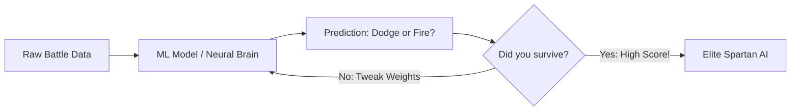
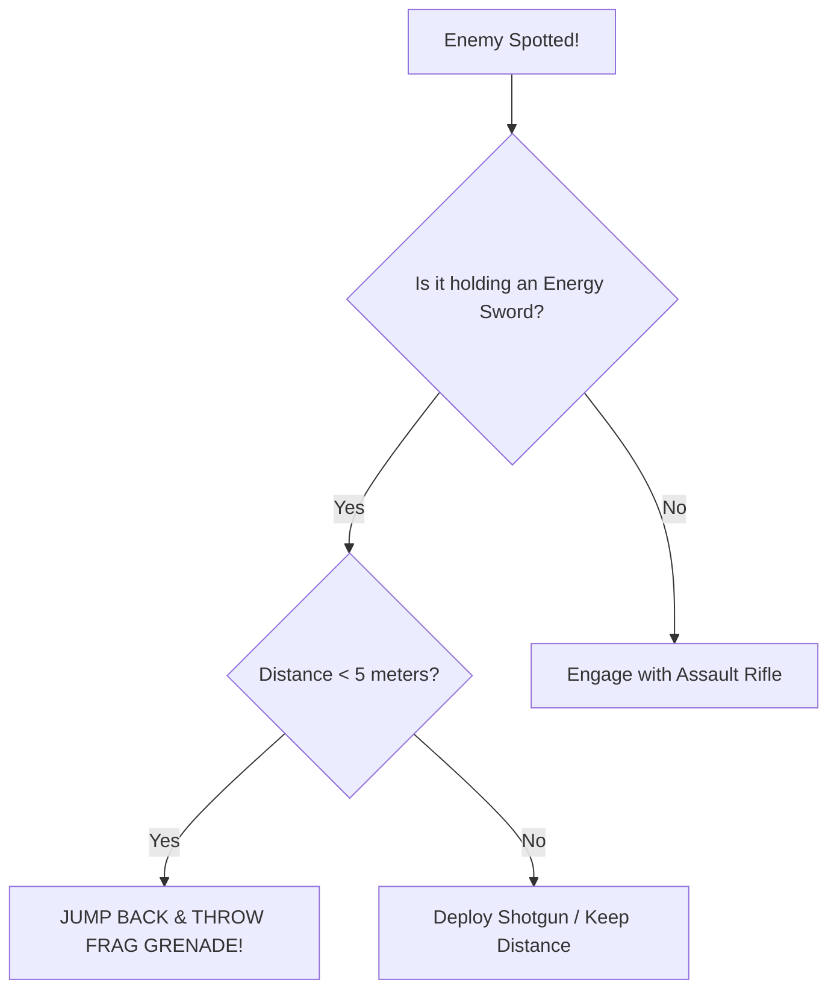
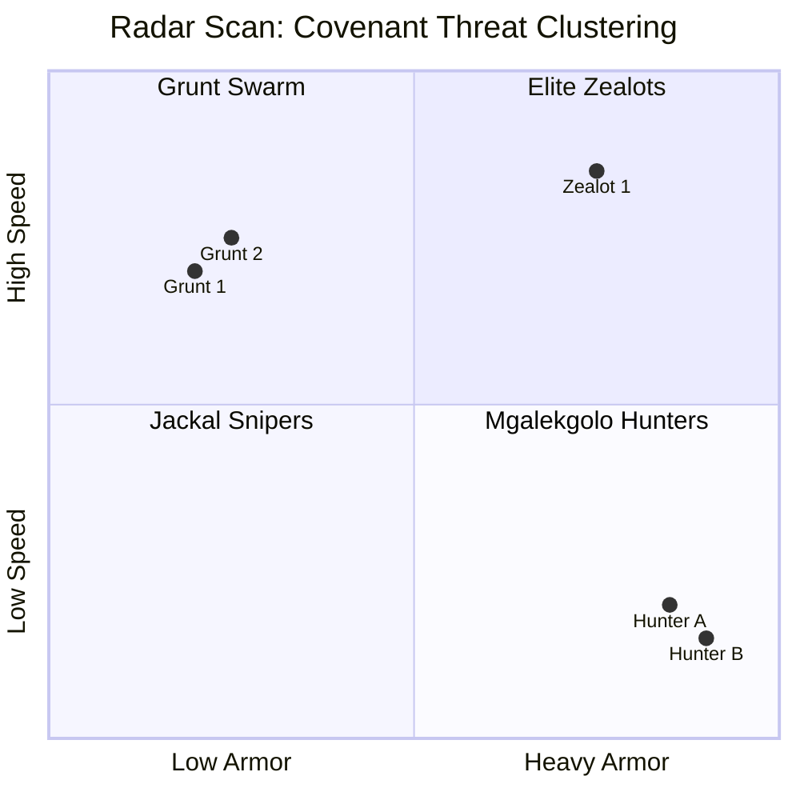
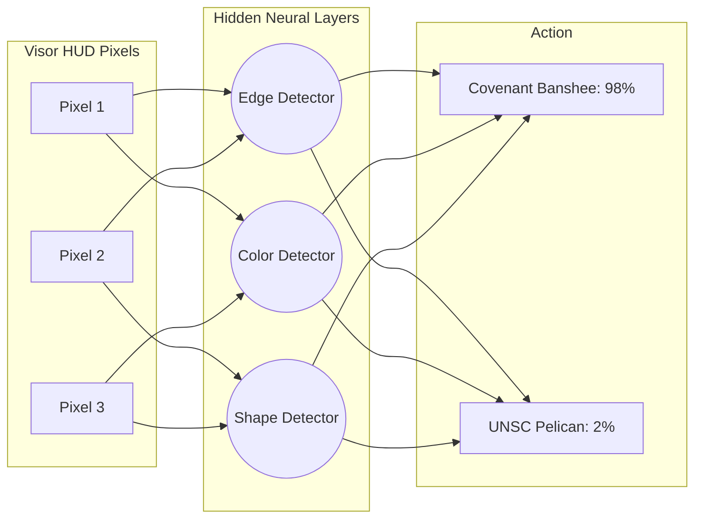
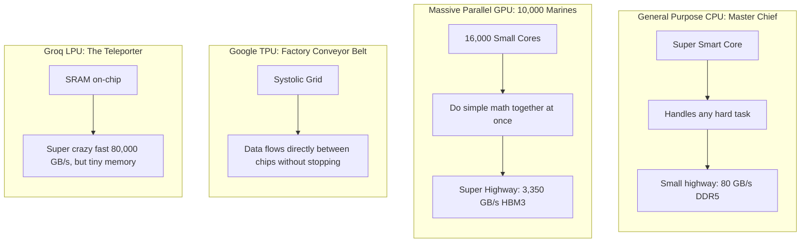

# Spartan-II Machine Learning Field Manual: 10th Grade Edition
**Instructor:** Prof. Decker (Callsign: Professor)  
**Trainee:** Master Chief (Spartan-117)  
**Subject:** How AI Thinks, Prompts, and the Hardware Engines Powering It

---

## 🛰️ 1. What is Machine Learning? (The Spartan Training Sim)

Traditional programming is like a **strict checklist**:
> *"If shield < 20%, press B to sprint behind cover."*

**Machine Learning (ML)** is like a **Spartan battle simulator**:
> You don't give the Spartan rules; you drop them into 1,000,000 simulated firefights. When they get shot, they lose points. When they win, they get points. The computer tweaks its own internal settings until it becomes unstoppable!



---

## 🎯 2. The Core Roster: 4 Big Types of ML

### 📈 A. Regression (The Sniper Distance Estimator)
* **What it does:** Predicts a **continuous number** (like shield recharge time or bullet drop distance).
* **10th Grade Analogy:** You plot dots on a graph of *Target Distance* vs *Bullet Drop*. Regression is just drawing the **best-fitting line** through the dots!
* **Spartan Example:** *"Chief, based on wind speed and 500m distance, aim 3 inches higher."*

```
Bullet Drop (Inches)
  ▲
  │              * (Actual Shot)
  │          *  /
  │         /  *
  │     *  /  <--- Best-Fit Regression Line: y = mx + b
  │    /  *
  │   *
  └────────────────────────► Target Distance (Meters)
```

---

### 🌳 B. Decision Trees & Random Forests (The Combat Flowchart)
* **What it does:** Plays **20 Questions** to make a decision.
* **10th Grade Analogy:** You follow branches on a tree based on simple Yes/No questions.
* **Random Forest:** Instead of one tree, you ask an entire squad of 100 Spartans to vote!



---

### 🎨 C. Clustering (Sorting the Covenant Horde with No Labels)
* **What it does:** Groups data into piles based on who looks alike, **without being told the answers** (Unsupervised Learning).
* **10th Grade Analogy:** You dump a giant bin of 1,000 LEGO bricks onto the floor. Without knowing what sets they came from, you group all the blue blocks, all the 2x4 red blocks, and all the tiny wheels together.
* **Spartan Example (K-Means Clustering):** Radar scans 50 blips:
  * **Cluster 1 (Tiny, fast, grouped together):** Grunts!
  * **Cluster 2 (Shielded, medium speed):** Jackals!
  * **Cluster 3 (Huge, slow, heavily armored):** Hunters!



---

### 🧠 D. Neural Networks & Deep Learning (The Spartan Synapse Web)
* **What it does:** Stacks layers of fake digital brain cells (neurons).
* **How it works:** 
  1. Input layer takes in pixels from your HUD visor.
  2. Hidden layers multiply numbers by **weights** (importance dials).
  3. If the signal is strong enough, the neuron "fires" to the next layer.
  4. Output layer shouts: *"Banshee incoming from top right!"*



---

## ⚡ 3. The Big Boss: Transformers & The "Attention" Mechanism

Older AIs (RNNs/LSTMs) read text like an old tape recorder: word... by... word... and by the end of a long sentence, they forgot what word #1 was.

In 2017, scientists invented **Transformers**.
* **Key Magic:** **Self-Attention**! 
* Instead of reading sequentially, a Transformer looks at the **entire sentence at once** and connects words that care about each other.

> **Example:** *"The Master Chief reloaded his Magnum and fired **it** at the Brute."*
> 
> What does **"it"** refer to? The Magnum? Or the Chief?  
> The **Attention Mechanism** draws a thick mental laser beam between **"it"** and **"Magnum"**!

---

## 💬 4. How Prompts Work: Giving Orders to Cortana

A prompt doesn't rewrite the AI's brain. It gives it a **flashlight** to search its memory!

| Prompt Strategy | What It Means | Spartan Order Example | Result |
|---|---|---|---|
| **Zero-Shot** | Asking with zero examples. | *"Cortana, how do we destroy this Halo ring?"* | Uses general knowledge; might be vague. |
| **Few-Shot** | Giving 2-3 examples first. | *"Mission 1: Destroy reactor. Mission 2: Detonate Autumn. Mission 3: What do we do at Delta Halo?"* | Follows pattern precisely. |
| **Chain-of-Thought (CoT)** | Telling the AI to think step-by-step. | *"Cortana, calculate survival odds. Explain your steps before giving the final answer."* | **Huge accuracy boost!** Stops the AI from blurting out bad guesses. |
| **Tree-of-Thoughts (ToT)** | Branching multiple ideas and picking the best. | *"Explore 3 escape routes from High Charity. Score each route 1-10. Discard bad routes and explore deeper."* | Elite problem-solving for crazy complex battles. |
| **RAG (Search Engine Hookup)** | Searching a manual before speaking. | *"Cortana, look up the Forerunner index archives FIRST, then answer."* | Stops hallucinations cold. |

---

## 🖥️ 5. The Hardware: What Machines Run These AIs?

Why can't you just run ChatGPT-4 on your home gaming PC or Xbox?



### 🏎️ The Silicon Comparison:
1. **CPU (The Master Chief):** One ultra-smart soldier. Can solve complex logic puzzles, but can only do 16 or 32 math problems at once.
2. **GPU (10,000 Marines Firing at Once):** Built with thousands of tiny cores. While Chief fires one sniper shot, 10,000 Marines fire all at once. AI matrix math is just millions of simple multiplications, making GPUs king!
3. **TPU (UNSC Factory Conveyor Belt):** A "Systolic Array." Data passes directly from cell to cell like a bucket brigade without waiting to write to memory.
4. **LPU / Groq (The Hyper-Speed Sprinter):** Uses on-chip SRAM instead of big heavy memory chips. Speeds through tokens at 500 words per second!

### 🛑 Why Does ChatGPT Slow Down While Answering?
* **Prefill Phase (Reading your prompt):** The GPU is in full blast mode—reading everything in parallel. It is **Compute-Bound** (super fast!).
* **Decode Phase (Generating words one-by-one):** The GPU has to load the *entire 100-Gigabyte model* into memory just to pick ONE single next word! It's like driving an 18-wheeler semi-truck across town just to deliver a single grain of rice. That's why it's **Memory-Bandwidth Bound**!

---

## 🎖️ Final Mission Debrief: Professor's Cheat Sheet

1. **Regression:** Predicts numbers on a line.
2. **Trees & Forests:** 20 Questions game with branches.
3. **Clustering:** Sorting enemies into piles with no name tags.
4. **Neural Networks:** Stacks of fake neurons tweaking knobs.
5. **Transformers:** Paying attention to all words at once.
6. **Prompts:** Directing the spotlight (Chain-of-Thought = think before speaking).
7. **GPUs vs CPUs:** 10,000 Marines doing easy math beats 1 Master Chief doing it one-by-one!
