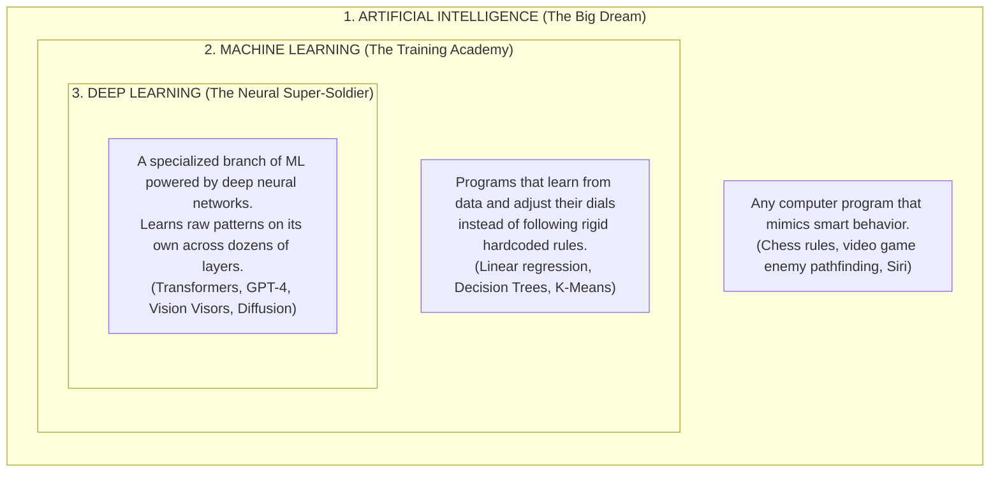
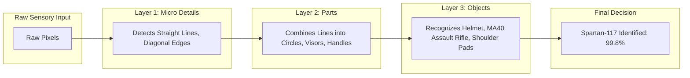

# The Neural Connection: How Machine Learning and Deep Learning Fit Together

**Instructor:** Dr. Christopher Decker, Ph.D.  
**Series:** CS-530 Visual Learning Monograph  
**Student:** Spartan Master Chief (Clear, Visual, Zero-Nonsense Guide)  
**Topic:** How Machine Learning and Deep Learning Are Connected

---

## 🎯 The Big Picture: Russian Nesting Dolls

To understand how **Machine Learning (ML)** and **Deep Learning (DL)** connect, imagine a set of UNSC military boxes stacked inside each other:



> **The Golden Rule:**  
> **All Deep Learning IS Machine Learning.**  
> But **not all Machine Learning is Deep Learning.**  
> *(Just like all Spartans are UNSC soldiers, but not every UNSC soldier is a 7-foot armored Spartan super-soldier!)*

---

## 🔍 The Game-Changing Difference: Who Does the Homework?

How do traditional Machine Learning and Deep Learning actually operate differently when solving a mission?

### Scenario: Identifying an Incoming Covenant Ghost on Radar

```
METHOD A: Classical Machine Learning (Human Does the Heavy Lifting)
┌─────────────────┐       ┌────────────────────────┐       ┌─────────────────┐       ┌────────────┐
│ Raw HUD Pixels  │ ───►  │ Human Engineer         │ ───►  │ ML Model        │ ───►  │ "It is a   │
│ of incoming vehicle     │ Hand-measures:         │       │ (Decision Tree) │       │ Ghost!"    │
│                 │       │ - Weight: 1.2 Tons     │       │ Compares numbers│       │            │
│                 │       │ - Color: Purple        │       │                 │       │            │
│                 │       │ - Speed: 80 km/h       │       │                 │       │            │
└─────────────────┘       └────────────────────────┘       └─────────────────┘       └────────────┘
                                   ▲
                    (Feature Engineering: Painful bottleneck!)

─────────────────────────────────────────────────────────────────────────────────────────────

METHOD B: Deep Learning (Model Does EVERYTHING End-to-End)
┌─────────────────┐       ┌──────────────────────────────────────────────────┐       ┌────────────┐
│ Raw HUD Pixels  │ ───►  │ Deep Neural Network (Hidden Layers)              │ ───►  │ "It is a   │
│ (Zero human     │       │ [Layer 1: Edges & Contours]                      │       │ Ghost!"    │
│  prep required) │       │ [Layer 2: Curved Purple Armor Panels]            │       │            │
│                 │       │ [Layer 3: Boosters & Plasma Guns]                │       │            │
│                 │       │ [Layer 4: Full Vehicle Recognition]              │       │            │
└─────────────────┘       └──────────────────────────────────────────────────┘       └────────────┘
```

1. **In Classical Machine Learning:**  
   The human has to extract the **features** by hand (called *Feature Engineering*). You have to tell the computer: *"Look at column 3 for speed, column 4 for armor thickness."* If the human forgets to measure something important, the model fails.
2. **In Deep Learning:**  
   You dump raw pixels, audio waves, or text files straight into the network. The **deep layers of neurons automatically discover what matters** without any human hand-holding!

---

## 🧠 What Makes Deep Learning "Deep"?

The word **"Deep"** simply means: **Layers stacked on top of layers!**

* A **Shallow** model has 0 or 1 hidden layer.
* A **Deep** model has dozens or hundreds of stacked hidden layers.



Each layer takes the output of the layer before it and abstracts it:
* **Layer 1** sees: `| / \ —` (slashes and edges).
* **Layer 2** sees: curves and circles.
* **Layer 3** sees: a visor and armor plate.
* **Final Layer** shouts: *"That's the Master Chief!"*

---

## 📈 The Data Scaling Curve: Why Deep Learning Conquered AI

Why did the world suddenly switch from classical ML to Deep Learning over the last 10 years?

```
Accuracy / Capability
  ▲
  │                                     / (Deep Learning / Neural Nets)
  │                                   /   Keeps getting smarter the more
  │                                 /     data and compute you feed it!
  │                               /
  │    -------------------------/ (Classical ML: Trees, Regression, SVM)
  │   /                            Hits a plateau! More data doesn't help.
  │  /
  │ /
  └────────────────────────────────────────────────► Amount of Training Data
```

* **Classical ML hits a brick wall:** Giving a decision tree 10,000,000 pictures doesn't make it 10,000 times smarter. It runs out of steam because human-made features can't capture infinite nuance.
* **Deep Learning scales infinitely:** The bigger the neural network and the more data you feed it, the more intelligent and capable it becomes. That is why ChatGPT, Midjourney, and self-driving cars exist today.

---

## ⚔️ Head-to-Head Comparison: When to Use Which

| Tactical Scenario | Classical Machine Learning | Deep Learning |
|---|---|---|
| **Best Data Type** | Numbers, spreadsheets, CSV files, SQL tables | Images, audio, human speech, messy text, video |
| **Data Needed** | Hundreds to thousands of rows | Hundreds of thousands to billions of examples |
| **Compute Power Needed** | Simple CPU (runs in seconds on your laptop) | Massive GPUs (NVIDIA H100, RTX 4090, Apple Silicon) |
| **Training Time** | Seconds to minutes | Days to weeks across GPU server clusters |
| **Can you explain why?** | **Yes (White Box):** You can inspect the tree branches | **Hard (Black Box):** Millions of math weights working together |
| **Real-World Example** | Predicting house prices, loan approval, fraud score | Cortana speech recognition, AI art, LLM chatbots |

---

## 💡 The Takeaway Formula

$$\text{Artificial Intelligence} \supset \text{Machine Learning} \supset \text{Deep Learning}$$

* **Machine Learning** taught computers how to find patterns in numbers using statistics.
* **Deep Learning** stacked thousands of artificial neurons together so computers could learn complex sights, sounds, and human language all by themselves!
